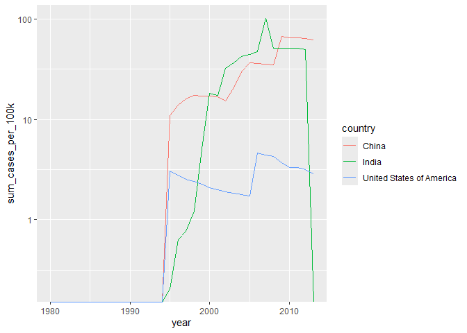
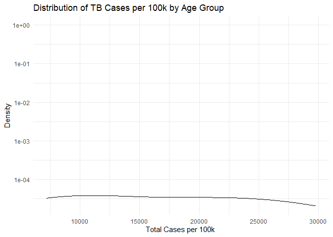
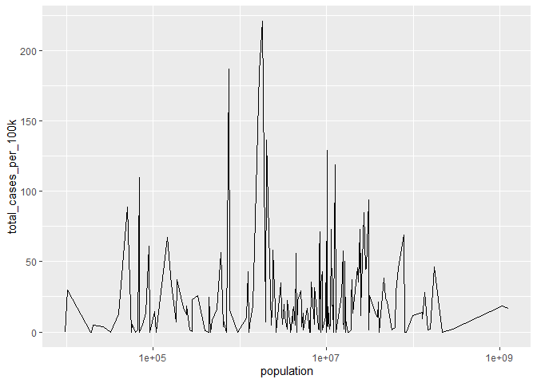

Formative Assessment 2
================
Ramilo, Zion John Yousef
2025-02-17

Import

``` r
who <- who2
population <- wb_data(indicator = "SP.POP.TOTL")
population$country <- replace(population$country, population$country == "United States", "United States of America")
```

Shapes of the datasets

``` r
cat("TB WHO Data:\n")
```

    ## TB WHO Data:

``` r
cat("Rows: ",dim(who)[1],"\nColumns: ",dim(who)[2])
```

    ## Rows:  7240 
    ## Columns:  58

``` r
cat("\n\nPopulation Data:\n")
```

    ## 
    ## 
    ## Population Data:

``` r
cat("Rows: ",dim(population)[1],"\nColumns: ",dim(population)[2])
```

    ## Rows:  13888 
    ## Columns:  9

Variable Typesof Population

``` r
sapply(population, class)
```

    ##        iso2c        iso3c      country         date  SP.POP.TOTL         unit 
    ##  "character"  "character"  "character"    "numeric"    "numeric"  "character" 
    ##   obs_status     footnote last_updated 
    ##  "character"  "character"       "Date"

``` r
colSums(is.na(population))
```

    ##        iso2c        iso3c      country         date  SP.POP.TOTL         unit 
    ##            0            0            0            0           30        13888 
    ##   obs_status     footnote last_updated 
    ##        13888        13686            0

Fix any anomalies

``` r
population2 <- subset(population, select = -c(unit,obs_status,footnote,iso2c,iso3c,last_updated)) %>% 
  na.omit()
glimpse(population2)
```

    ## Rows: 13,858
    ## Columns: 3
    ## $ country     <chr> "Afghanistan", "Afghanistan", "Afghanistan", "Afghanistan"…
    ## $ date        <dbl> 2023, 2022, 2021, 2020, 2019, 2018, 2017, 2016, 2015, 2014…
    ## $ SP.POP.TOTL <dbl> 41454761, 40578842, 40000412, 39068979, 37856121, 36743039…

``` r
colSums(is.na(population2))
```

    ##     country        date SP.POP.TOTL 
    ##           0           0           0

Identify variables (WHO dataset)

``` r
colnames(who)
```

    ##  [1] "country"    "year"       "sp_m_014"   "sp_m_1524"  "sp_m_2534" 
    ##  [6] "sp_m_3544"  "sp_m_4554"  "sp_m_5564"  "sp_m_65"    "sp_f_014"  
    ## [11] "sp_f_1524"  "sp_f_2534"  "sp_f_3544"  "sp_f_4554"  "sp_f_5564" 
    ## [16] "sp_f_65"    "sn_m_014"   "sn_m_1524"  "sn_m_2534"  "sn_m_3544" 
    ## [21] "sn_m_4554"  "sn_m_5564"  "sn_m_65"    "sn_f_014"   "sn_f_1524" 
    ## [26] "sn_f_2534"  "sn_f_3544"  "sn_f_4554"  "sn_f_5564"  "sn_f_65"   
    ## [31] "ep_m_014"   "ep_m_1524"  "ep_m_2534"  "ep_m_3544"  "ep_m_4554" 
    ## [36] "ep_m_5564"  "ep_m_65"    "ep_f_014"   "ep_f_1524"  "ep_f_2534" 
    ## [41] "ep_f_3544"  "ep_f_4554"  "ep_f_5564"  "ep_f_65"    "rel_m_014" 
    ## [46] "rel_m_1524" "rel_m_2534" "rel_m_3544" "rel_m_4554" "rel_m_5564"
    ## [51] "rel_m_65"   "rel_f_014"  "rel_f_1524" "rel_f_2534" "rel_f_3544"
    ## [56] "rel_f_4554" "rel_f_5564" "rel_f_65"

``` r
who2 <- pivot_longer(who,cols=sp_m_014:rel_f_65,names_to = "new_ep_f014", values_to = "cases") %>% 
  mutate(cases = replace_na(cases, 0))
glimpse(who2)
```

    ## Rows: 405,440
    ## Columns: 4
    ## $ country     <chr> "Afghanistan", "Afghanistan", "Afghanistan", "Afghanistan"…
    ## $ year        <dbl> 1980, 1980, 1980, 1980, 1980, 1980, 1980, 1980, 1980, 1980…
    ## $ new_ep_f014 <chr> "sp_m_014", "sp_m_1524", "sp_m_2534", "sp_m_3544", "sp_m_4…
    ## $ cases       <dbl> 0, 0, 0, 0, 0, 0, 0, 0, 0, 0, 0, 0, 0, 0, 0, 0, 0, 0, 0, 0…

Seperate values

``` r
who_tidy <- who2 %>% 
  separate(new_ep_f014,into=c("tb_type","sex","age_range"), sep="_")
glimpse(who_tidy)
```

    ## Rows: 405,440
    ## Columns: 6
    ## $ country   <chr> "Afghanistan", "Afghanistan", "Afghanistan", "Afghanistan", …
    ## $ year      <dbl> 1980, 1980, 1980, 1980, 1980, 1980, 1980, 1980, 1980, 1980, …
    ## $ tb_type   <chr> "sp", "sp", "sp", "sp", "sp", "sp", "sp", "sp", "sp", "sp", …
    ## $ sex       <chr> "m", "m", "m", "m", "m", "m", "m", "f", "f", "f", "f", "f", …
    ## $ age_range <chr> "014", "1524", "2534", "3544", "4554", "5564", "65", "014", …
    ## $ cases     <dbl> 0, 0, 0, 0, 0, 0, 0, 0, 0, 0, 0, 0, 0, 0, 0, 0, 0, 0, 0, 0, …

Identify variables (Population dataset)

``` r
colnames(population2)
```

    ## [1] "country"     "date"        "SP.POP.TOTL"

Perform pivot operation on population data

``` r
population3 <- population2 %>% 
  pivot_wider(names_from = date,values_from = SP.POP.TOTL)
glimpse(population3)
```

    ## Rows: 217
    ## Columns: 65
    ## $ country <chr> "Afghanistan", "Albania", "Algeria", "American Samoa", "Andorr…
    ## $ `2023`  <dbl> 41454761, 2745972, 46164219, 47521, 80856, 36749906, 93316, 45…
    ## $ `2022`  <dbl> 40578842, 2777689, 45477389, 48342, 79705, 35635029, 92840, 45…
    ## $ `2021`  <dbl> 40000412, 2811666, 44761099, 49225, 78364, 34532429, 92349, 45…
    ## $ `2020`  <dbl> 39068979, 2837849, 44042091, 49761, 77380, 33451132, 91846, 45…
    ## $ `2019`  <dbl> 37856121, 2854191, 43294546, 50209, 76474, 32375632, 91364, 44…
    ## $ `2018`  <dbl> 36743039, 2866376, 42505035, 50908, 75162, 31297155, 90926, 44…
    ## $ `2017`  <dbl> 35688935, 2873457, 41689299, 51586, 73763, 30234839, 90468, 44…
    ## $ `2016`  <dbl> 34700612, 2876101, 40850721, 52245, 72181, 29183070, 89969, 43…
    ## $ `2015`  <dbl> 33831764, 2880703, 40019529, 52878, 72174, 28157798, 89409, 43…
    ## $ `2014`  <dbl> 32792523, 2889104, 39205031, 53466, 73737, 27160769, 88765, 43…
    ## $ `2013`  <dbl> 31622704, 2895092, 38414171, 54006, 75194, 26165620, 88064, 42…
    ## $ `2012`  <dbl> 30560034, 2900401, 37646166, 54489, 76834, 25177394, 87260, 42…
    ## $ `2011`  <dbl> 29347708, 2905195, 36903376, 54895, 77783, 24218352, 86332, 41…
    ## $ `2010`  <dbl> 28284089, 2913021, 36188236, 55228, 80706, 23294825, 85320, 41…
    ## $ `2009`  <dbl> 27466101, 2927519, 35490445, 55528, 83888, 22414773, 84173, 40…
    ## $ `2008`  <dbl> 26482622, 2947314, 34816961, 55828, 83495, 21578655, 82912, 40…
    ## $ `2007`  <dbl> 25909852, 2970017, 34189416, 56113, 81877, 20778561, 81704, 40…
    ## $ `2006`  <dbl> 25424094, 2992547, 33623506, 56374, 79585, 20015279, 80604, 39…
    ## $ `2005`  <dbl> 24404567, 3011487, 33109249, 56617, 77421, 19291161, 79611, 39…
    ## $ `2004`  <dbl> 23560654, 3026939, 32628286, 56818, 74325, 18600423, 78719, 38…
    ## $ `2003`  <dbl> 22733049, 3039616, 32175818, 56971, 69486, 17943712, 77884, 38…
    ## $ `2002`  <dbl> 21378117, 3051010, 31750835, 57062, 66506, 17327699, 77032, 38…
    ## $ `2001`  <dbl> 20284307, 3060173, 31331221, 57053, 65852, 16747208, 76069, 37…
    ## $ `2000`  <dbl> 20130327, 3089027, 30903893, 56855, 65685, 16194869, 74912, 37…
    ## $ `1999`  <dbl> 19887785, 3108778, 30474354, 56248, 65710, 15667235, 73666, 36…
    ## $ `1998`  <dbl> 19159996, 3128530, 30054133, 55334, 65382, 15159370, 72412, 36…
    ## $ `1997`  <dbl> 18452091, 3148281, 29579301, 54362, 64700, 14660413, 71053, 35…
    ## $ `1996`  <dbl> 17763266, 3168033, 29033044, 53353, 63984, 14170973, 69612, 35…
    ## $ `1995`  <dbl> 17065836, 3187784, 28470191, 52316, 63912, 13699778, 68189, 35…
    ## $ `1994`  <dbl> 16250794, 3207536, 27887279, 51251, 64612, 13249764, 66843, 34…
    ## $ `1993`  <dbl> 14943172, 3227287, 27277048, 50159, 63272, 12827135, 65587, 34…
    ## $ `1992`  <dbl> 13278974, 3247039, 26628568, 49038, 60200, 12423712, 64404, 33…
    ## $ `1991`  <dbl> 12238879, 3266790, 25987928, 47882, 56667, 12023529, 63387, 33…
    ## $ `1990`  <dbl> 12045660, 3286542, 25375810, 46640, 52597, 11626360, 63066, 32…
    ## $ `1989`  <dbl> 11874088, 3227943, 24754485, 45191, 50620, 11238562, 63325, 32…
    ## $ `1988`  <dbl> 11523298, 3142336, 24109536, 43615, 49416, 10861291, 63623, 31…
    ## $ `1987`  <dbl> 11387818, 3083605, 23443624, 42072, 47653, 10497858, 63946, 31…
    ## $ `1986`  <dbl> 11420074, 3022635, 22745499, 40571, 45734, 10139450, 64276, 30…
    ## $ `1985`  <dbl> 11426852, 2964762, 22008544, 39103, 43825, 9779120, 64591, 303…
    ## $ `1984`  <dbl> 11190221, 2904429, 21271969, 37667, 42273, 9425917, 64882, 298…
    ## $ `1983`  <dbl> 10917982, 2843960, 20558115, 36271, 40565, 9082983, 64934, 293…
    ## $ `1982`  <dbl> 10991378, 2784278, 19872348, 34909, 38764, 8751648, 64785, 289…
    ## $ `1981`  <dbl> 11937581, 2726056, 19220704, 33584, 37169, 8435607, 64665, 284…
    ## $ `1980`  <dbl> 13169311, 2671997, 18607174, 32403, 35782, 8133872, 64513, 280…
    ## $ `1979`  <dbl> 13655567, 2617832, 18036655, 31611, 34306, 7847207, 64274, 275…
    ## $ `1978`  <dbl> 13611441, 2566266, 17506974, 31076, 32735, 7576734, 64038, 271…
    ## $ `1977`  <dbl> 13340756, 2513546, 17015994, 30521, 31097, 7317829, 63862, 267…
    ## $ `1976`  <dbl> 13059851, 2458526, 16409170, 29959, 29436, 7074664, 63762, 262…
    ## $ `1975`  <dbl> 12773954, 2404831, 15678596, 29390, 27773, 6842947, 63839, 258…
    ## $ `1974`  <dbl> 12469127, 2350124, 15133502, 28875, 26130, 6613367, 64058, 254…
    ## $ `1973`  <dbl> 12157999, 2296752, 14771147, 28436, 24523, 6388528, 64342, 250…
    ## $ `1972`  <dbl> 11853696, 2243126, 14427072, 27995, 22957, 6174262, 64615, 246…
    ## $ `1971`  <dbl> 11567667, 2187853, 14098936, 27533, 21442, 5991102, 64729, 242…
    ## $ `1970`  <dbl> 11290128, 2135479, 13783719, 27026, 19977, 5852788, 64528, 238…
    ## $ `1969`  <dbl> 11017409, 2081695, 13475960, 26375, 18555, 5763685, 63819, 235…
    ## $ `1968`  <dbl> 10756922, 2022272, 13172614, 25614, 17176, 5702699, 62809, 231…
    ## $ `1967`  <dbl> 10505959, 1965598, 12876118, 24863, 15837, 5641807, 61837, 227…
    ## $ `1966`  <dbl> 10266395, 1914573, 12590069, 24136, 14626, 5581386, 60900, 224…
    ## $ `1965`  <dbl> 10036008, 1864791, 12365976, 23406, 13634, 5521981, 59970, 221…
    ## $ `1964`  <dbl> 9814318, 1814135, 12179813, 22673, 12764, 5464187, 59020, 2176…
    ## $ `1963`  <dbl> 9604487, 1762621, 11982118, 21966, 11915, 5408320, 58138, 2142…
    ## $ `1962`  <dbl> 9404406, 1711319, 11800771, 21298, 11086, 5354310, 57336, 2107…
    ## $ `1961`  <dbl> 9214083, 1659800, 11628883, 20666, 10283, 5301583, 56540, 2072…
    ## $ `1960`  <dbl> 9035043, 1608800, 11424922, 20133, 9510, 5231654, 55603, 20386…

Population Tidy Ver.

``` r
population_tidy <- population2 %>% 
  rename(
    population=SP.POP.TOTL,
    year = date
  )
glimpse(population_tidy)
```

    ## Rows: 13,858
    ## Columns: 3
    ## $ country    <chr> "Afghanistan", "Afghanistan", "Afghanistan", "Afghanistan",…
    ## $ year       <dbl> 2023, 2022, 2021, 2020, 2019, 2018, 2017, 2016, 2015, 2014,…
    ## $ population <dbl> 41454761, 40578842, 40000412, 39068979, 37856121, 36743039,…

Joining Datasets

``` r
tuberculosis <- who_tidy %>%
  group_by(country, year, sex, tb_type, age_range) %>%
  summarise(cases = sum(cases, na.rm = TRUE), .groups = "drop")

tuberculosis <- merge(tuberculosis, population_tidy, by = c("country", "year"), all.x = TRUE)
glimpse(tuberculosis)
```

    ## Rows: 405,440
    ## Columns: 7
    ## $ country    <chr> "Afghanistan", "Afghanistan", "Afghanistan", "Afghanistan",…
    ## $ year       <dbl> 1980, 1980, 1980, 1980, 1980, 1980, 1980, 1980, 1980, 1980,…
    ## $ sex        <chr> "f", "m", "m", "f", "f", "m", "f", "f", "m", "m", "m", "f",…
    ## $ tb_type    <chr> "rel", "sn", "rel", "sn", "rel", "ep", "rel", "sn", "sn", "…
    ## $ age_range  <chr> "3544", "1524", "5564", "2534", "2534", "2534", "4554", "35…
    ## $ cases      <dbl> 0, 0, 0, 0, 0, 0, 0, 0, 0, 0, 0, 0, 0, 0, 0, 0, 0, 0, 0, 0,…
    ## $ population <dbl> 13169311, 13169311, 13169311, 13169311, 13169311, 13169311,…

United States TB Cases by Sex

``` r
us_tb_cases<- tuberculosis %>% 
  filter(country == "United States of America" & year >= 2001) %>% 
  group_by(sex) %>% 
  summarise(sum_cases = sum(cases))
glimpse(us_tb_cases)
```

    ## Rows: 2
    ## Columns: 2
    ## $ sex       <chr> "f", "m"
    ## $ sum_cases <dbl> 43982, 73769

Males are more prone to having TB within the United States during this
21st Century.

Aggregate cases into cases by 100K

``` r
tuberculosis2 <- tuberculosis %>% 
  group_by(year, sex, tb_type, age_range) %>% 
  mutate(cases_per_100k = (cases / population) * 100000)
glimpse(tuberculosis2)
```

    ## Rows: 405,440
    ## Columns: 8
    ## Groups: year, sex, tb_type, age_range [1,904]
    ## $ country        <chr> "Afghanistan", "Afghanistan", "Afghanistan", "Afghanist…
    ## $ year           <dbl> 1980, 1980, 1980, 1980, 1980, 1980, 1980, 1980, 1980, 1…
    ## $ sex            <chr> "f", "m", "m", "f", "f", "m", "f", "f", "m", "m", "m", …
    ## $ tb_type        <chr> "rel", "sn", "rel", "sn", "rel", "ep", "rel", "sn", "sn…
    ## $ age_range      <chr> "3544", "1524", "5564", "2534", "2534", "2534", "4554",…
    ## $ cases          <dbl> 0, 0, 0, 0, 0, 0, 0, 0, 0, 0, 0, 0, 0, 0, 0, 0, 0, 0, 0…
    ## $ population     <dbl> 13169311, 13169311, 13169311, 13169311, 13169311, 13169…
    ## $ cases_per_100k <dbl> 0, 0, 0, 0, 0, 0, 0, 0, 0, 0, 0, 0, 0, 0, 0, 0, 0, 0, 0…

Identify Highest and Lowest Cases by 100k by country and year

``` r
highest_cases_per_100k <- tuberculosis2 %>% 
  group_by(country,year) %>% 
  summarise(sum_cases_per_100k = sum(cases_per_100k), .groups = "drop") %>% 
  arrange(desc(sum_cases_per_100k))
```

Top 10 highest:

``` r
head(highest_cases_per_100k,10)
```

    ## # A tibble: 10 × 3
    ##    country       year sum_cases_per_100k
    ##    <chr>        <dbl>              <dbl>
    ##  1 South Africa  2009               742.
    ##  2 Samoa         2009               713.
    ##  3 South Africa  2010               697.
    ##  4 South Africa  2008               626.
    ##  5 Lesotho       2009               583.
    ##  6 South Africa  2013               571.
    ##  7 South Africa  2007               568.
    ##  8 Lesotho       2010               559.
    ##  9 South Africa  2012               552.
    ## 10 South Africa  2011               546.

Top 10 Lowest

``` r
tail(highest_cases_per_100k%>%na.omit(),10)  
```

    ## # A tibble: 10 × 3
    ##    country   year sum_cases_per_100k
    ##    <chr>    <dbl>              <dbl>
    ##  1 Zimbabwe  1992                  0
    ##  2 Zimbabwe  1993                  0
    ##  3 Zimbabwe  1994                  0
    ##  4 Zimbabwe  1995                  0
    ##  5 Zimbabwe  1996                  0
    ##  6 Zimbabwe  1997                  0
    ##  7 Zimbabwe  1998                  0
    ##  8 Zimbabwe  1999                  0
    ##  9 Zimbabwe  2000                  0
    ## 10 Zimbabwe  2001                  0

Plot the total cases per 100k as a function of year for China, India,
and the United States.

``` r
cases_per_100k_CIUS <- highest_cases_per_100k %>% 
  filter(country == "China" | country == "India" | country == "United States of America") %>% 
  arrange(year)
ggplot(cases_per_100k_CIUS,aes(x=year,y=sum_cases_per_100k,color=country))+
  geom_line()+
  scale_y_log10()
```

    ## Warning in scale_y_log10(): log-10 transformation introduced infinite values.

<!-- -->
During the 21st century TB was seen high growth as compared to 2000s and
below implying that there was a point within the 21st century that
enabled TB to increase within the contires.

Compare distributions of total cases per 100k (summed over years, sexes,
and TB types) across age groups

``` r
tuberculosis_ageRange <- tuberculosis2 %>%
  group_by(age_range) %>%
  summarise(total_cases_per_100k = sum(cases_per_100k, na.rm = TRUE), .groups = "drop")
ggplot(tuberculosis_ageRange, aes(x = total_cases_per_100k)) +
  geom_density(alpha = 0.5) +
  scale_y_log10() + 
  labs(
    title = "Distribution of TB Cases per 100k by Age Group",
    x = "Total Cases per 100k ",
    y = "Density"
  ) +
  theme_minimal()
```

<!-- -->
The graph shows a stable constant number of TB cases per 100k.

Create a plot to evaluate whether the number of cases per 100k in 2000
was related to a country’s population

``` r
tb_population <- tuberculosis2 %>% 
  filter(year==2000) %>% 
  group_by(population) %>% 
  summarise(total_cases_per_100k = sum(cases_per_100k, na.rm = TRUE), .groups = "drop")

ggplot(tb_population,aes(x=population,y=total_cases_per_100k))+
  geom_line()+ 
  scale_x_log10()
```

    ## Warning: Removed 1 row containing missing values or values outside the scale range
    ## (`geom_line()`).

<!-- -->
The plot shows very high volatility as population grows the more
unpredictable the total cases per 100k is produced.
