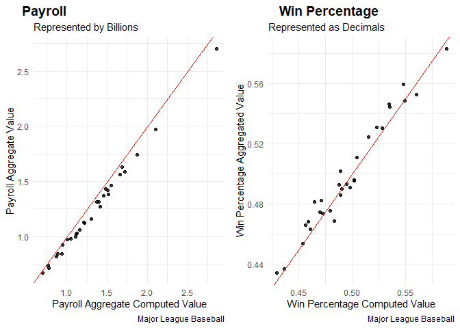
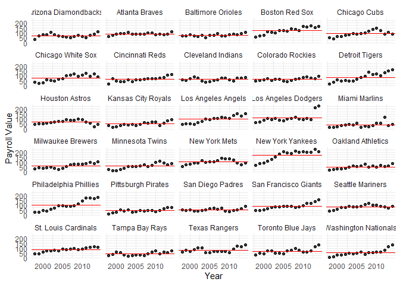
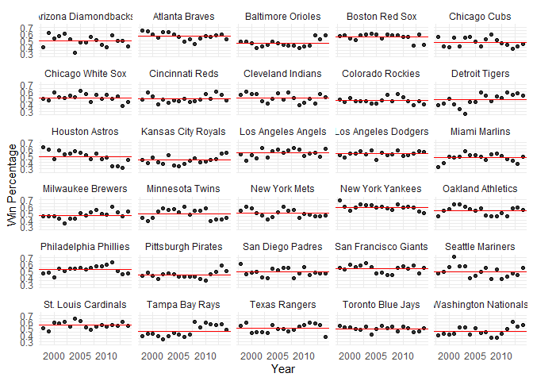
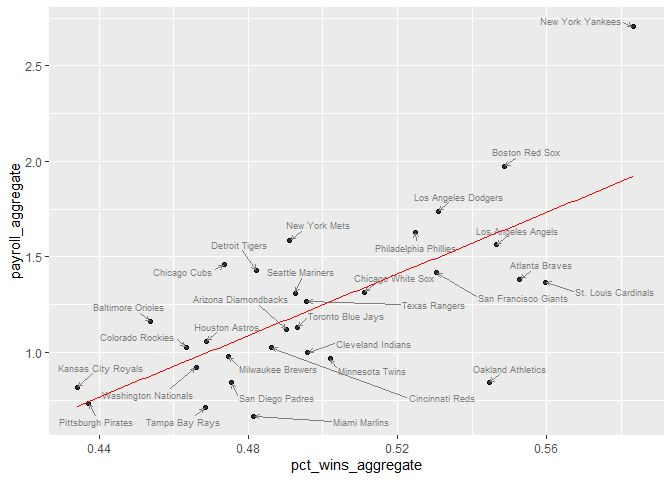

Formative Assessment 3 Ramilo
================
Ramilo, Zion John Yousef
2025-02-23

Case study: Major League Baseball

What is the relationship between payroll and wins among Major League
Baseball (MLB) teams? In this homework, we’ll find out by wrangling,
exploring, and modeling the dataset in MLPayData_Total.rdata, which
contains the winning records and the payroll data of all 30 MLB teams
from 1998 to 2014.

The dataset has the following variables:

- payroll: total team payroll (in billions of dollars) over the 17-year
  period
- avgwin: the aggregated win percentage over the 17-year period
- Team.name.2014: the name of the team
- p1998, . . . , p2014: payroll for each year (in millions of dollars)
- X1998, . . . , X2014: number of wins for each year
- X1998.pct, . . . , X2014.pct: win percentage for each year

1 Wrangle (35 points for correctness; 5 points for presentation)

1.1 Import (5 points)

- Import the data into a tibble called mlb_raw and print it.
- How many rows and columns does the data have?
- Does this match up with the data description given above?

``` r
# Loading the data set
load("~/RStudioFiles/Data-Wrangling/FA3/ml_pay.rdata")
is_tibble(ml_pay) # Determine if it is a tibble
```

    ## [1] FALSE

``` r
# From a data frame into a tibble
mlb_raw <- as_tibble(ml_pay) # Transform to tibble
is_tibble(mlb_raw)
```

    ## [1] TRUE

``` r
# Print dimensions of the tibble
cat("`mlb_raw` dimensions: ",dim(mlb_raw)[1],"X",dim(mlb_raw)[2])
```

    ## `mlb_raw` dimensions:  30 X 54

- **The given data has 30 rows and 54 columns.**
- **By the description stated above it has data from 1998-2014 which
  means 17 years of data are involved and amongst those years 3
  categories were observed; payroll, number of wins, and win percentage
  of every team per year which will be 51. Adding the 2 aggregate
  columns and the team column we would have 54 total columns which is
  exactly the same as what we have gotten.**

1.2 Quality control (15 points)

It’s always a good idea to check whether a dataset is internally
consistent. In this case, we are given both aggregated and yearly data,
so we can check whether these match. To this end, carry out the
following steps:

- Create a new tibble called mlb_aggregate_computed based on aggregating
  the data in mlb_yearly, containing columns named team,
  payroll_aggregate_computed, and pct_wins_aggregate_computed.
- Ideally, mlb_aggregate_computed would match mlb_aggregate. To check
  whether this is the case, join these two tibbles into
  mlb_aggregate_joined (which should have five columns: team,
  payroll_aggregate, pct_wins_aggregate, payroll_aggregate_computed, and
  pct_wins_aggregate_computed.)
- Create scatter plots of payroll_aggregate_computed versus
  payroll_aggregate and pct_wins\_ aggregate_computed versus
  pct_wins_aggregate, including a 45◦ line in each. Display these
  scatter plots side by side, and comment on the relationship between
  the computed and provided aggregate statistics.

**Solution.**

``` r
# Split the data set into 2
# Aggregated data
mlb_aggregate <- mlb_raw %>% 
  select(Team.name.2014,payroll,avgwin) %>% 
  rename(
    team = Team.name.2014,
    payroll_aggregate = payroll,
    pct_wins_aggregate = avgwin
  )

kable(head(mlb_aggregate,5))
```

| team                 | payroll_aggregate | pct_wins_aggregate |
|:---------------------|------------------:|-------------------:|
| Arizona Diamondbacks |          1.120874 |          0.4902585 |
| Atlanta Braves       |          1.381712 |          0.5527605 |
| Baltimore Orioles    |          1.161212 |          0.4538250 |
| Boston Red Sox       |          1.972359 |          0.5487172 |
| Chicago Cubs         |          1.459767 |          0.4736557 |

``` r
# year-by-year data
mlb_yearly <- mlb_raw %>% 
  select(-c(payroll,avgwin)) %>% 
  rename(
    team = Team.name.2014
  ) %>% 
  pivot_longer(
    cols = p1998:p2014,
    names_to = "p_year",
    values_to = "payroll"
  ) %>% 
  pivot_longer(
    cols = X2014:X1998,
    names_to = "Xyear",
    values_to = "num_wins"
  ) %>% 
  pivot_longer(
    cols = X2014.pct:X1998.pct,
    names_to = "Xyear.pct",
    values_to = "pct_wins"
  ) %>% 
  mutate(
    p_year = as.numeric(str_remove(p_year,"p")),
    Xyear = as.numeric(str_remove(Xyear,"X")),
    Xyear.pct = as.numeric(str_remove(str_remove(Xyear.pct,"X"),".pct"))
  )

payroll_mlb <- mlb_yearly %>% 
  select(team,p_year,payroll)%>%
  distinct(team, p_year, payroll, .keep_all = TRUE) %>% 
  rename(
    year = p_year
  )

num_wins_mlb <- mlb_yearly %>% 
  select(team,Xyear,num_wins)%>%
  distinct(team, Xyear, num_wins, .keep_all = TRUE) %>% 
  rename(
    year = Xyear
  )

win_perc_mlb <- mlb_yearly %>% 
  select(team,Xyear.pct,pct_wins)%>%
  distinct(team, Xyear.pct, pct_wins, .keep_all = TRUE) %>% 
  rename(
    year = Xyear.pct
  )

mlb_yearly <- payroll_mlb %>% 
  left_join(num_wins_mlb,by=c("team","year")) %>% 
  left_join(win_perc_mlb,by=c("team","year")) %>%
  select(team, year, payroll, pct_wins, num_wins)
kable(head(mlb_yearly,5))
```

| team                 | year |   payroll |  pct_wins | num_wins |
|:---------------------|-----:|----------:|----------:|---------:|
| Arizona Diamondbacks | 1998 |  31.61450 | 0.3987730 |       65 |
| Arizona Diamondbacks | 1999 |  70.49600 | 0.6134969 |      100 |
| Arizona Diamondbacks | 2000 |  81.02783 | 0.5246914 |       85 |
| Arizona Diamondbacks | 2001 |  81.20651 | 0.5679012 |       92 |
| Arizona Diamondbacks | 2002 | 102.82000 | 0.6049383 |       98 |

Joining the aggregate data and the computed data

``` r
# Double checking the aggregated table
mlb_aggregate_computed <- mlb_yearly %>% 
  group_by(team) %>% 
  summarize(
    payroll_aggregate_computed = sum(payroll)/1000,
    pct_wins_aggregate_computed = sum(num_wins)/(n()*162)
  )

# Joining 2 tables together
mlb_aggregate_joined <- mlb_aggregate %>% 
  left_join(mlb_aggregate_computed,by="team")

kable(head(mlb_aggregate_joined,5))
```

| team | payroll_aggregate | pct_wins_aggregate | payroll_aggregate_computed | pct_wins_aggregate_computed |
|:---|---:|---:|---:|---:|
| Arizona Diamondbacks | 1.120874 | 0.4902585 | 1.222984 | 0.4901961 |
| Atlanta Braves | 1.381712 | 0.5527605 | 1.518310 | 0.5606391 |
| Baltimore Orioles | 1.161212 | 0.4538250 | 1.305271 | 0.4538853 |
| Boston Red Sox | 1.972359 | 0.5487172 | 2.103581 | 0.5493827 |
| Chicago Cubs | 1.459767 | 0.4736557 | 1.551726 | 0.4724038 |

Creating scatter plots of payroll_aggregate_computed versus
payroll_aggregate and pct_wins\_ aggregate_computed

``` r
# Creating 2 plots for aggregated vs computed
aggregated_v_computed_plt1 <- ggplot(mlb_aggregate_joined,aes(x=payroll_aggregate_computed,y=payroll_aggregate))+
  geom_point(
    size = 1.5,
    alpha = 0.8
  )+
  theme_minimal()+
  labs(
    title = " ",
    caption = "Major League Baseball",
    subtitle = "Represented by Billions",
  )+
  xlab("Payroll Aggregate Computed Value")+
  ylab("Payroll Aggregate Value")+
  geom_abline(slope = 1, intercept = 0, color = "red", linetype = "solid", linewidth = 0.5)

aggregated_v_computed_plt2 <- ggplot(mlb_aggregate_joined,aes(x=pct_wins_aggregate_computed,y=pct_wins_aggregate))+
  geom_point(
    size = 1.5,
    alpha = 0.8
  )+
  theme_minimal()+
  labs(
    title = " ",
    caption = "Major League Baseball",
    subtitle = "Represented as Decimals",
  )+
  xlab("Win Percentage Computed Value")+
  ylab("Win Percentage Aggregated Value")+
  geom_abline(slope = 1, intercept = 0, color = "red", linetype = "solid", linewidth = 0.5)

# Joining 2 plots together
aggregated_v_computed_plt <- plot_grid(
  aggregated_v_computed_plt1, 
  aggregated_v_computed_plt2, 
  labels = c("Payroll", "Win Percentage"), 
  ncol = 2
)
aggregated_v_computed_plt
```

<!-- -->
**As shown between the two graphs there is an error within the
difference between the aggregated and computed data, however it’s error
is not that large**

2 Explore (50 points for correctness; 10 points for presentation) Now
that the data are in tidy format, we can explore them by producing
visualizations and summary statistics.

2.1 Payroll across years (15 points)

- Plot payroll as a function of year for each of the 30 teams, faceting
  the plot by team and adding a red dashed horizontal line for the mean
  payroll across years of each team.

- Using dplyr, identify the three teams with the greatest
  payroll_aggregate_computed, and print a table of these teams and their
  payroll_aggregate_computed.

- Using dplyr, identify the three teams with the greatest percentage
  increase in payroll from 1998 to 2014 (call it pct_increase), and
  print a table of these teams along with pct_increase as well as their
  payroll figures from 1998 and 2014.

- How are the metrics payroll_aggregate_computed and pct_increase
  reflected in the plot above, and how can we see that the two sets of
  teams identified above are the top three in terms of these metrics?

Plotting payroll as a function of year for each team

``` r
# Plot payroll interms of year
mlb_means <- mlb_yearly %>%
  group_by(team) %>%
  summarize(mean_payroll = mean(payroll, na.rm = TRUE))

payroll_per_year_plt <- ggplot(mlb_yearly,aes(x=year,y=payroll))+
  geom_point(
    size = 1.5,
    alpha = 0.8
  )+
  theme_minimal()+
  xlab("Year")+
  ylab("Payroll Value")+
  facet_wrap(~team,ncol=5)+
  geom_hline(data = mlb_means, aes(yintercept = mean_payroll), color = "red", linetype = "solid", size = 0.7)
```

    ## Warning: Using `size` aesthetic for lines was deprecated in ggplot2 3.4.0.
    ## ℹ Please use `linewidth` instead.
    ## This warning is displayed once every 8 hours.
    ## Call `lifecycle::last_lifecycle_warnings()` to see where this warning was
    ## generated.

``` r
payroll_per_year_plt
```

<!-- -->
Identifying the three teams with the greatest payroll_aggregate_computed

``` r
# Find highest payroll within the computed data
sorted_payroll_mlb <- mlb_aggregate_computed %>% 
  select(team,payroll_aggregate_computed) %>% 
  arrange(desc(payroll_aggregate_computed))

kable(head(sorted_payroll_mlb,3), caption = "Top 3 Highest Payroll")
```

| team                | payroll_aggregate_computed |
|:--------------------|---------------------------:|
| New York Yankees    |                   2.857093 |
| Boston Red Sox      |                   2.103581 |
| Los Angeles Dodgers |                   1.874194 |

Top 3 Highest Payroll

Identifying winrate increase for each team from 1998 and 2014

``` r
# Find winrate percentage increase
sorted_pct_win_increase <- mlb_yearly %>% 
  select(team,year,pct_wins) %>% 
  pivot_wider(names_from = "year",values_from = pct_wins) %>% 
  mutate(
    pct_increase = `2014` - `1998`
  ) %>% 
  left_join(mlb_aggregate_computed,by="team") %>% 
  select(team,pct_increase,payroll_aggregate_computed) %>% 
  arrange(desc(pct_increase))
kable(head(sorted_pct_win_increase,3), caption = "Top 3 Highest Win Percentage Increase")
```

| team                 | pct_increase | payroll_aggregate_computed |
|:---------------------|-------------:|---------------------------:|
| Washington Nationals |    0.1575650 |                  0.9466941 |
| Miami Marlins        |    0.1475849 |                  0.6980929 |
| Detroit Tigers       |    0.1434805 |                  1.4839380 |

Top 3 Highest Win Percentage Increase

- **Given by the plot above which indicates payroll across the year it
  is clearly seen that the New York Yankees had their payout increase as
  the year increase indicating a positive relationship. For the increase
  of payroll indicated within the plot there is a huge jump from one
  year to another which signifies a sudden increase in payroll for the
  teams.**

2.2 Win percentage across years (15 points)

- Plot pct_wins as a function of year for each of the 30 teams, faceting
  the plot by team and adding a red dashed horizontal line for the
  average pct_wins across years of each team.
- Using dplyr, identify the three teams with the greatest
  pct_wins_aggregate_computed and print a table of these teams along
  with pct_wins_aggregate_computed.
- Using dplyr, identify the three teams with the most erratic pct_wins
  across years (as measured by the standard deviation, call it
  pct_wins_sd) and print a table of these teams along with pct_wins_sd.
- How are the metrics pct_wins_aggregate_computed and pct_wins_sd
  reflected in the plot above, and how can we see that the two sets of
  teams identified above are the top three in terms of these metrics?

Plot pct_wins as a function of year for each of the 30 teams

``` r
# Win percentage
mlb_pct_win_means <- mlb_yearly %>%
  group_by(team) %>%
  summarize(mean_pct_win = mean(pct_wins, na.rm = TRUE))

pct_win_per_year_plt <- ggplot(mlb_yearly,aes(x=year,y=pct_wins))+
  geom_point(
    size = 1.5,
    alpha = 0.8
  )+
  theme_minimal()+
  xlab("Year")+
  ylab("Win Percentage")+
  facet_wrap(~team,ncol=5)+
  geom_hline(data = mlb_pct_win_means, aes(yintercept = mean_pct_win), color = "red", linetype = "solid", size = 0.7)
pct_win_per_year_plt
```

<!-- -->
Identifying highest win percentage

``` r
# top 3 teams with high pct
sorted_pct_win_mlb <- mlb_aggregate_computed %>% 
  select(team,pct_wins_aggregate_computed) %>% 
  arrange(desc(pct_wins_aggregate_computed))

kable(head(sorted_pct_win_mlb,3), caption = "Top 3 Highest Win Percentage")
```

| team             | pct_wins_aggregate_computed |
|:-----------------|----------------------------:|
| New York Yankees |                   0.5885984 |
| Atlanta Braves   |                   0.5606391 |
| Boston Red Sox   |                   0.5493827 |

Top 3 Highest Win Percentage

Identifying top 3 most erratic teams

``` r
# top 3 most erratic teams
sorted_erratic_pct_win_increase <- mlb_yearly %>% 
  select(team,pct_wins) %>% 
  group_by(team)%>%
  summarise(
    pct_wins_sd = sd(pct_wins)
  ) %>% 
  arrange(desc(pct_wins_sd))
kable(head(sorted_erratic_pct_win_increase,3), caption = "Top 3 Most Erratic Teams")
```

| team             | pct_wins_sd |
|:-----------------|------------:|
| Houston Astros   |   0.0914336 |
| Detroit Tigers   |   0.0897654 |
| Seattle Mariners |   0.0892271 |

Top 3 Most Erratic Teams

- **Through the plot above it is shown that the teams with the top
  highest win percentage have consistently been able to perform good
  through out the progression of the game. Most erratic teams have
  points that mostly don’t align with the mean of each win percentage,
  to which means that throughout the year this team performs
  significantly performs differently for each iteration.**

2.3 Win percentage versus payroll (15 points)

Let us investigate the relationship between win percentage and payroll.

- Create a scatter plot of pct_wins versus payroll based on the
  aggregated data, labeling each point with the team name using
  geom_text_repel from the ggrepel package and adding the least squares
  line.
- Is the relationship between payroll and pct_wins positive or negative?
  Is this what you would expect, and why?

``` r
# Plot win percentage and payroll
win_perc_v_payroll <- ggplot(mlb_aggregate, aes(x = pct_wins_aggregate, y = payroll_aggregate)) +
  geom_point(
    size = 1.5,
    alpha = 0.8
  )+
  geom_text_repel(
    aes(label = team),
    size = 2.5,
    min.segment.length = 0, 
    seed = 42, 
    box.padding = 0.5,
    max.overlaps = Inf,
    arrow = arrow(length = unit(0.010, "npc")),
    nudge_x = .001,
    nudge_y = .001,
    color = "grey50"
  )+
  geom_smooth(method = "lm", se = FALSE, color = "red", size = 0.5)
win_perc_v_payroll
```

    ## `geom_smooth()` using formula = 'y ~ x'

<!-- -->

- **The relationship indicated by the plot shows that there exist a
  positive relationship between payroll and the win percentage of the
  team, meaning as the payroll increases, it is highly likely that it is
  due to the win percent increasing. This is to be expected since if the
  team improves their performance their value as players and as a team
  increases thus increasing their payrolls.**

2.4 Team efficiency (5 points)

Define a team’s efficiency as the ratio of the aggregate win percentage
to the aggregate payroll—more efficient teams are those that win more
with less money.

- Using dplyr, identify the three teams with the greatest efficiency,
  and print a table of these teams along with their efficiency, as well
  as their pct_wins_aggregate_computed and payroll_aggregate_computed.
- In what sense do these three teams appear efficient in the previous
  plot?

``` r
# Identify the most efficient teams
mlb_aggregate_computed <- mlb_aggregate_computed %>% 
  mutate(
    team_efficiency = pct_wins_aggregate_computed / payroll_aggregate_computed
  ) %>% 
  arrange(desc(team_efficiency))

kable(head(mlb_aggregate_computed,3), caption = "Top 3 Most Efficient Teams")
```

| team | payroll_aggregate_computed | pct_wins_aggregate_computed | team_efficiency |
|:---|---:|---:|---:|
| Miami Marlins | 0.6980929 | 0.4647785 | 0.6657832 |
| Oakland Athletics | 0.8875729 | 0.5355846 | 0.6034261 |
| Tampa Bay Rays | 0.7761869 | 0.4586057 | 0.5908444 |

Top 3 Most Efficient Teams

- **The ratio is describing the efficiency of each teams where we want
  to determine the teams that has a high percentage but a relatively low
  payroll, implying the identified teams are highly efficient because of
  it.**
